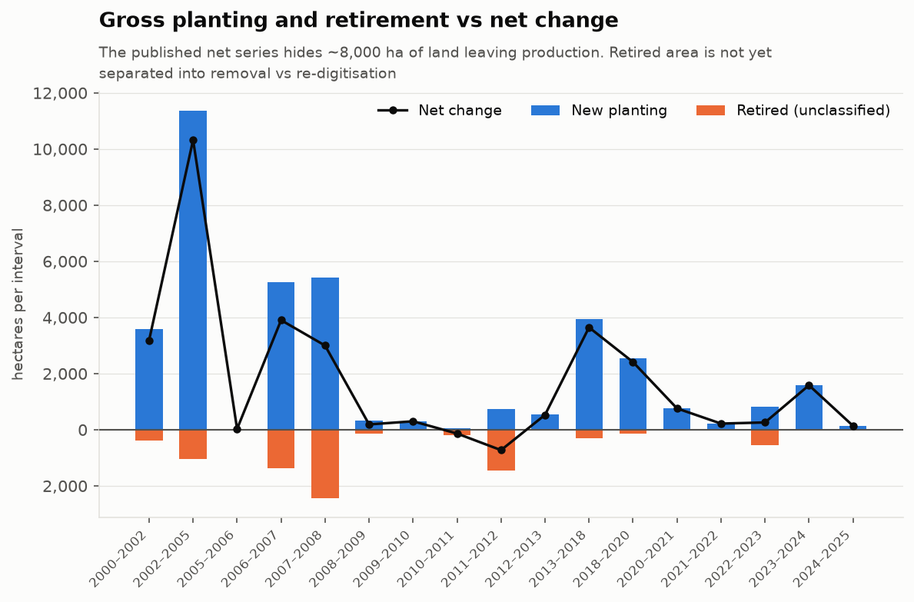
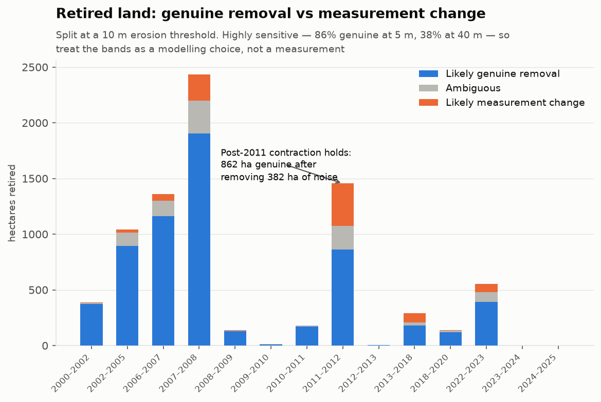
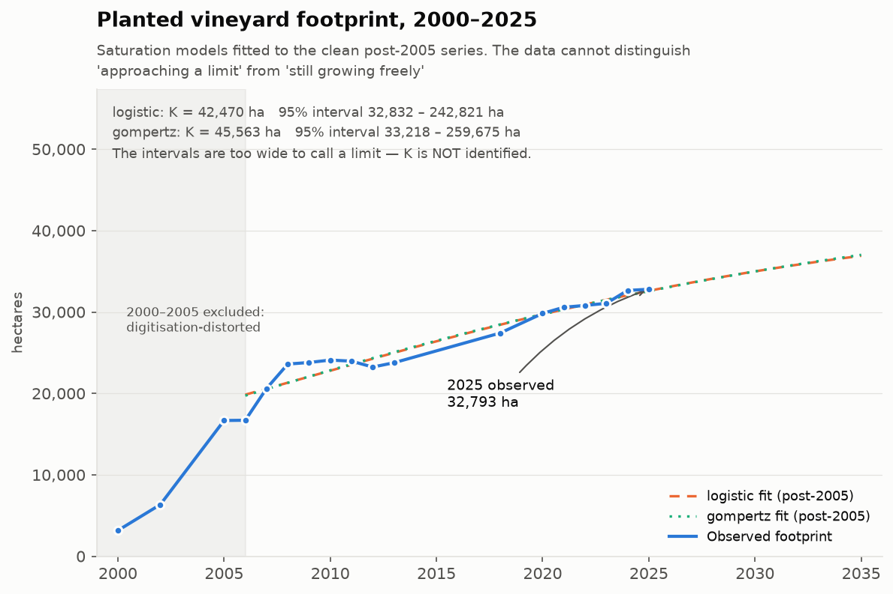
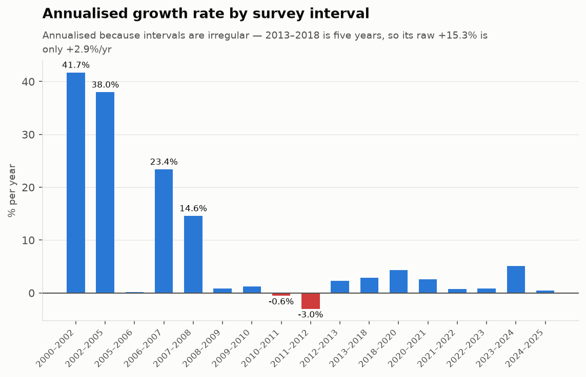
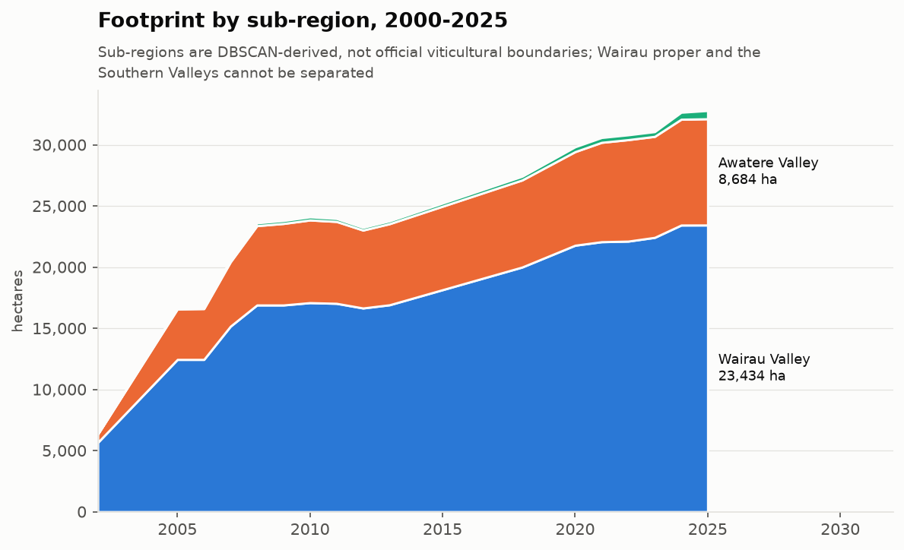

# Twenty-five years of vineyard expansion in Marlborough

**A geospatial case study in recovering change from data that cannot track it.**

Source: Marlborough District Council aerial vineyard survey, published on data.govt.nz.
18 surveys between 2000 and 2025, 59,099 parcel-years.
All figures generated by the pipeline in `src/`; none are transcribed by hand.

---

## The question, and the obstacle

How has Marlborough's planted vineyard area changed since 2000, and is growth slowing?

The obstacle is that the data cannot answer this directly. The source carries exactly four
fields — `FID`, `Year`, `MidYearDate`, `AreaHectares` — and **no persistent parcel identifier
across survey years**. Each survey is an independent polygon snapshot. There is no variety, owner,
producer or yield anywhere in it, and `MidYearDate` is a synthetic 1 July placeholder carrying no
information beyond the year.

So every statistic here derives from **geometry, area, and year alone**. That constraint is what
makes the spatial work the method rather than the decoration.

---

## What the published numbers say, and what they hide

Summing parcel areas per year gives the headline growth: **3,162 ha in 2000 → 32,793 ha in 2025**,
a 10.4× increase.

That series is *correct* but *incomplete*. It reports only the net position each year. Because
parcels cannot be tracked between surveys, it cannot say how much land was newly planted or how
much left production — only the difference between them.

Dissolving each year's parcels into a single footprint and taking set differences between
consecutive surveys recovers both sides:

| | 2000–2025 |
|---|---|
| Gross new planting | **37,630 ha** |
| Gross retired | **7,999 ha** |
| Net change | 29,631 ha |
| Churn ratio | **1.27×** |

**The published net series conceals roughly 8,000 hectares of land leaving production.** Two
intervals are dominated by it: 2010→11 retired 403% of what it gained, and 2011→12, 199%.



### A premise that did not survive contact with the data

I expected the dissolved footprint to come in well below the naive sum of parcel areas, because
overlapping polygons within a year would be double-counted. **It did not.** Maximum overlap across
all 18 surveys is 0.31 ha out of 32,793 — 0.0009%, floating-point noise.

The source polygons are topologically clean. The dissolve is therefore a *validation of the
published data*, not a correction to it, and is reported as such. The technique still earns its
place — it is what recovers the gross flows above — but not for the reason I first thought.

---

## Is that retired land really vines being pulled out?

Not necessarily, and this mattered enough to test. A survey that re-drew block boundaries at finer
resolution moves a polygon edge without a single vine being removed, and that registers as
"retired" too. The suspicious intervals coincide exactly with where mean parcel size drops — the
signature of a digitisation change.

Classifying each retired polygon by how much of it survives eroding the prior footprint by 10 m
(a thin rim against a surviving edge reads as re-digitisation; a compact interior block reads as
real removal) gives:

- **6,201 ha (77.5%)** likely genuine removal
- **920 ha (11.5%)** ambiguous
- **877 ha (11.0%)** likely measurement change

An independent shape signal agrees: the measurement-change band's median piece is 0.008 ha with
mean compactness 0.105, against 0.373 ha and 0.308 for the genuine band.

**But the threshold is doing a lot of work.** At a 5 m erosion the split is 86% genuine; at 40 m,
38%. There is no buffer distance at which it stabilises, so this is a modelling choice, not a
measurement — and the report states the band rather than a number.

What does survive the test: **the 2011–12 contraction is real.** 862 ha remains genuine after
removing 382 ha of measurement noise, against 170 ha and 4.5 ha in the neighbouring intervals.



---

## Is growth slowing? The honest answer is that we cannot tell

This is the part where the analysis produced a negative result, and reporting it plainly is the
point.



Logistic and Gompertz saturation curves were fitted to the post-2005 series (n=15; the 2000, 2002
and 2005 surveys are digitisation-distorted and excluded). Both converge:

| Model | K | 95% interval |
|---|---|---|
| Logistic | 42,470 ha | 32,832 – 242,821 ha |
| Gompertz | 45,563 ha | 33,218 – 259,675 ha |

**Carrying capacity is not identified.** The intervals run to a quarter of a million hectares —
the data cannot distinguish "approaching a limit" from "still growing freely". No capacity figure
and no "years to saturation" projection is defensible from 18 irregularly-spaced observations of a
series that has not visibly turned over.

Three further reasons for caution, each of which also weakens the model comparison:

- **AICc cannot separate the two forms** (gap < 2 on the primary fit).
- **Residuals are autocorrelated** (lag-1 ≈ 0.6), so the fits are systematically missing structure
  rather than scattering around it. Both the AICc value and the bootstrap interval are weaker
  evidence than they appear.
- **Fitting all 18 years puts K *below* the present footprint** — an asymptote already passed.
  That is a diagnostic of the early-survey distortion, not a finding about growth.

### What can be said about the shape

The rate series is not monotone. Rapid expansion through 2008; near-zero to negative change across
2011–2012; renewed growth that **had already resumed by the 2018 survey**. The resumption date is
unobserved — there is no survey between 2013 and 2018, and that interval already shows +2.9%/yr.



Annualising matters here: 2013→2018 reads +15.3% raw, but that is five years wearing a one-year
label. At +2.9%/yr it is unremarkable.

---

## Where the growth happened



Density clustering on parcel centroids recovers the split Marlborough's geography implies — the
Wither Hills separate the Wairau plains from the Awatere Valley, and DBSCAN finds that gap with no
boundary layer. By 2025: Wairau and the Southern Valleys at 23,435 ha, Awatere at 8,684 ha.

It **cannot** separate Wairau Valley proper from the Southern Valleys — they are contiguous with no
physical gap — so those remain one bucket. These are algorithmically derived labels, not official
viticultural boundaries.

---

## Limitations

Stated plainly, because every one of them constrains what the figures above can be used for.

- **No parcel identity across years.** No survival analysis, no per-parcel trajectory, no "this
  vineyard grew". Change is recovered by set operations on geometry only.
- **n = 18 surveys.** That is the entire sample for any time-series fit; 59,099 parcels buy no
  additional statistical power.
- **Irregular intervals** (gaps 2013–2018, 2018–2020) make raw period growth non-comparable.
  Everything here is annualised.
- **Mean parcel size falls 27 → 6.5 ha.** This is finer polygon capture in later surveys, not
  fragmentation, and is not presented as a trend.
- **No causal variables exist.** There is no price, weather, or planting-intent data. The 2011–12
  contraction *coincides with* the post-GFC New Zealand wine glut; this analysis cannot show it was
  *caused* by it.
- **The retirement split is threshold-dependent**, as quantified above.

---

## Method

```
raw .gdb → 02 clean/reproject → 03 sub-region clustering → 05 spatial overlay
                                                         → 06 statistics
                                                         → 07 Tableau exports
```

Geometry is stored in EPSG:4326 for interoperability and measured in EPSG:2193 (NZTM2000), so every
area is in true metres. The artifact chain is immutable — each step writes a new file rather than
mutating its input.

**Verification.** 20 invariant checks (`tests/test_invariants.py`) assert that the overlay's set
algebra closes in both directions, that the dissolved footprint never exceeds the naive sum, that
sub-region series reconcile with the national total, and that figures quoted in this document match
what the pipeline computed. They found two real bugs: a sub-region first-appearance error losing
788 ha, and a rounding error in a project document.

Two review passes ran as subagents. A statistical review caught that an earlier version of this
report had the headline backwards — it claimed the saturation model was misspecified, when that
conclusion was an artefact of including the very surveys the project declares untrustworthy. The
corrected finding is the weaker, defensible one above.

---

## What I would do next

1. **Join an authoritative sub-region boundary layer** to replace the DBSCAN approximation and
   split Wairau proper from the Southern Valleys.
2. **Validate the retirement classification against ground truth** — even a handful of known
   removals would anchor the threshold that currently drives the split.
3. **Test for a changepoint statistically** rather than describing the rate series narratively.
   With n=18 this will likely support at most one break; reporting that honestly is the point.
4. **Bring in planting intent or price data** if any exists, since nothing in this dataset can
   speak to *why* the footprint moved.
